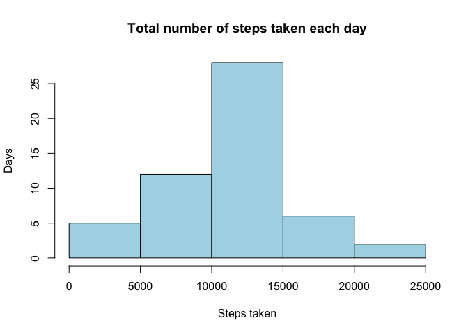
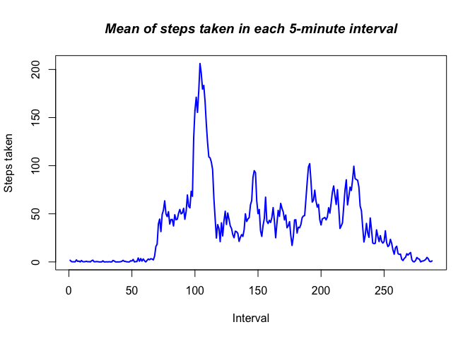
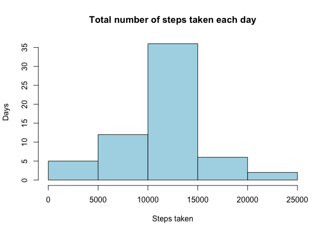
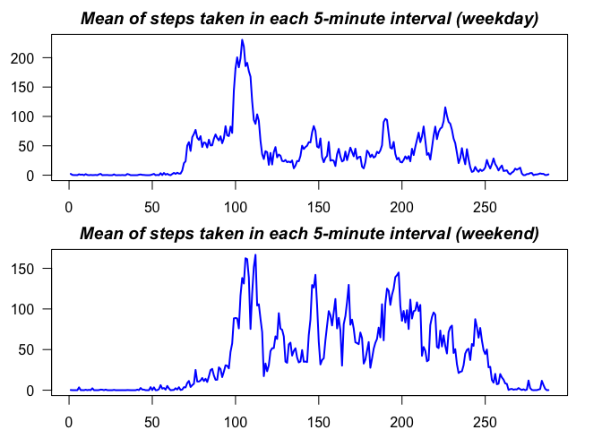

# Course Project 1

#Loading and preprocessing the data
Show any code that is needed to
  
1. Load the data (i.e. **read.csv()** )
2. Process/transform the data (if necessary) into a format suitable for your analysis


```r
#We start by checking if the required "activity.csv" file is available in the
#working directory. #If not, it will be unzipped:

#If the data is not available (as a csv file):
if(!file.exists("activity.csv")) {
        
        #We unzip it:
        unzip("repdata_data_activity.zip")
        
}

#Once we are sure that the required files are in the working directory, we will
#proceed to load them into memory. We know three important data that can speed
#up loading the file:
#1. The type of object contained in each column (three columns with the pattern:
#   integer, date, and an identifier that can be understood as an integer or
#   string of text).
#2. The total number of rows in the dataset.
#3. NA values are stored as "NA" (instead of "?" or another symbol).

#We call the "read.csv()" function with the parameters explained above. The
#dataset will be stored in memory as a data.frame:
raw_data<- read.csv("activity.csv",
                         header = TRUE,
                         sep = ",",
                         na.strings = "NA",
                         colClasses = c("integer", "Date", "integer"),
                         nrows = 17568)
```

#What is mean total number of steps taken per day?
For this part of the assignment, you can ignore the missing values in the dataset.
  
1. Calculate the total number of steps taken per day
2. If you do not understand the difference between a histogram and a barplot, research the difference between them. Make a histogram of the total number of steps taken each day
3. Calculate and report the mean and median of the total number of steps taken per day


```r
#Question 1:
#We create a subset of the data that contains only the rows where no value is
#missing. This subset will be used in this section as well as in the following
#two:
subset <- raw_data[complete.cases(raw_data),]

#Once we have done this subset, we apply the tapply function to perform the
#summation of the steps taken per each day in the dataset:
steps_per_day <- tapply(subset$steps, subset$date, sum)

#Question 2:
#Based on the calculations made in the previous question, we proceed to the
#realization of the desired histogram. It should be noted that we simultaneously
#proceed to its annotation:
hist(steps_per_day, col="lightblue",
                    main = "Total number of steps taken each day",
                    xlab = "Steps taken",
                    ylab = "Days")
```

<!-- -->

```r
#Question 3:
#We calculate the mean of steps taken per day:
round(mean(steps_per_day), 2)
```

```
## [1] 10766.19
```

```r
#We calculate the median of steps taken per day:
median(steps_per_day)
```

```
## [1] 10765
```

#What is the average daily activity pattern?
1. Make a time series plot (i.e. **type = "l"** ) of the 5-minute interval (x-axis) and the average number of steps taken, averaged across all days (y-axis)
2. Which 5-minute interval, on average across all the days in the dataset, contains the maximum number of steps?


```r
#Question 1:
#We should start by creating a subset of the data that contains only the rows
#where no value is missing. But this subset was created in the first question of
#the previous section so we will reuse it. It was called simply "subset".

#We apply the "tapply" function to the subset to calculate the mean of steps
#taken per each interval in the day:
steps_per_interval <- tapply(subset$steps, subset$interval, mean)

#Based on the calculations made in the previous step, we proceed to the
#realization of the desired plot:
plot(steps_per_interval, type = "l", lwd = 2, col = "blue",
     main = "Mean of steps taken in each 5-minute interval", font.main = 4,
     xlab = "Interval", ylab = "Steps taken")
```

<!-- -->

```r
#Question 2:
#To conclude this section, we calculate which interval, contains the maximum
#number of steps. We carry this out by finding the maximum of the variable
#"steps_per_day" and then seeing which interval corresponds:

#The maximum occurs in the following interval:
maximum <- which.max(steps_per_interval)
as.integer(names(steps_per_interval)[maximum])
```

```
## [1] 835
```

```r
#Although we are not asked explicitly in the problem definition, the maximum
#number of steps is:
round(max(steps_per_interval), 2)
```

```
## [1] 206.17
```

#Imputing missing values
Note that there are a number of days/intervals where there are missing values (coded as **NA** ). The presence of missing days may introduce bias into some calculations or summaries of the data.
  
1. Calculate and report the total number of missing values in the dataset (i.e. the total number of rows with **NA** s)
2. Devise a strategy for filling in all of the missing values in the dataset. The strategy does not need to be sophisticated. For example, you could use the mean/median for that day, or the mean for that 5-minute interval, etc.
3. Create a new dataset that is equal to the original dataset but with the missing data filled in.
4. Make a histogram of the total number of steps taken each day and calculate and report the **mean** and **median** total number of steps taken per day. Do these values differ from the estimates from the first part of the assignment? What is the impact of imputing missing data on the estimates of the total daily number of steps?


```r
#Question 1:
#In this question, we are asked to calculate the number of missing values in
#our data.frame. This could have been done with "sum(is.na(raw_data))". But as
#previously we have calculated a subset that contains only the rows where no
#value is missing, we can calculate the dimensions of both and do the
#subtraction (the first coordinate corresponds to the number of rows):
dim(raw_data)[1] - dim(subset)[1]
```

```
## [1] 2304
```

```r
#It should be noted that all missing values are in the first column
#(corresponding to the steps taken):
sum(is.na(raw_data)) == sum(is.na(raw_data$steps))
```

```
## [1] TRUE
```

```r
#Questions 2 & 3:
#In order to fill in the missing data, we are asked to choose a strategy. We
#have decided to use the following: we will fill the missing values with the
#average of that 5-minute interval. To do this, we should start by creating a
#subset of the data that contains only the rows where no value is missing. Then,
#we should apply the "tapply" function to the subset to calculate the mean of
#steps taken per each interval in the day. All of this was done in the first
#question of the previous section so we will reuse it. The values are stored in
#a variable called "steps_per_interval" but we store the calculations in a
#temporal data.frame to facilitate their use. We also label each column with its
#proper name:
temporary_data <- data.frame(steps_per_interval, names(steps_per_interval))
names(temporary_data) <- c("steps", "interval")

#Starting with a copy of "raw_data", we create the data.frame in which we will
#fill the missing values. We call it "final_data" because it will be the final
#version that will be used in the next section:
final_data <- raw_data

#This index stores which rows of "final_data" have missing values:
NAs <- is.na(final_data$steps)

#This vector stores which media (the index, not its value) must fill in each
#missing value:
matches <- match(final_data$interval[NAs], temporary_data$interval)

#Finally we make the substitution and with that we fill in the missing values:
final_data$steps[NAs] <- temporary_data$steps[matches]

#Question 4:
#In order to realize the desired histogram, we apply the "tapply" function to
#the "final_data" data.frame. This way, we perform the summation of the steps
#taken per each day in the dataset:
final_steps_per_day <- tapply(final_data$steps, final_data$date, sum)

#Based on the calculations made in the previous question, we proceed to the
#realization of the histogram. It should be noted that we simultaneously proceed
#to its annotation:
hist(final_steps_per_day, col="lightblue",
                          main = "Total number of steps taken each day",
                          xlab = "Steps taken",
                          ylab = "Days")
```

<!-- -->

```r
#We calculate the final mean of steps taken per day:
mean(final_steps_per_day)
```

```
## [1] 10766.19
```

```r
#We calculate the final median of steps taken per day:
median(final_steps_per_day)
```

```
## [1] 10766.19
```

```r
#We calculate what is the impact of imputing missing data on the estimates of
#the total daily number of steps. First we do it for the mean:
mean(final_steps_per_day) - mean(steps_per_day)
```

```
## [1] 0
```

```r
#Finally, we do it for the median:
median(final_steps_per_day) - median(steps_per_day)
```

```
## [1] 1.188679
```


#Are there differences in activity patterns between weekdays and weekends?
For this part the **weekdays()** function may be of some help here. Use the dataset with the filled-in missing values for this part.
  
1. Create a new factor variable in the dataset with two levels - "weekday" and "weekend" indicating whether a given date is a weekday or weekend day.
2. Make a panel plot containing a time series plot (i.e. **type = "l"** ) of the 5-minute interval (x-axis) and the average number of steps taken, averaged across all weekday days or weekend days (y-axis). See the README file in the GitHub repository to see an example of what this plot should look like using simulated data.


```r
#Question 1:
#In this question, we are asked to add a new factor type column to our
#data.frame so that we can separate weekdays from weekends. For this, we are
#told that we may find the "weekdays" function useful. The problem is that this
#function returns the name of the day written in the language in which the
#computer is configured. Because of this, since we can not know in advance which
#language will be used when the program is executed, we should create a version
#for every possible language. Therefore, we will use a different approach:     

#We start by converting each date to the "POSIXlt" format. We are only
#interested in the "wday" component that indicates with a number from 0 to 6,
#the day of the week (starting on Sunday). We store it in a new column:
final_data$day <- as.POSIXlt(final_data$date)$wday

#We convert this column to "factor" type and set the levels appropriately
#(weekends formed by 0 and 6, weekdays by the rest):
final_data$day <- factor(final_data$day)
levels(final_data$day) <- list("weekday" = c(1, 2, 3, 4, 5),
                               "weekend" = c(0, 6))

#Question 2:
#In the third section, we used the "tapply" function to calculate the mean of
#steps taken per each interval in the day. Now, we will also use it but with an
#extra parameter, the "factor" type column created in the previous question:
final_steps_per_interval <- tapply(final_data$steps,
                                   list(final_data$interval, final_data$day),
                                   mean)

#We represent the results in a panel plot. We begin by configuring how
#individual plots will be organized:
par(mfrow=c(2,1))
par(mar =c(2,3,2,2))

#We proceed to the realization of the first subplot:
plot(final_steps_per_interval[, 1], type = "l", lwd = 2, col = "blue",
     main = "Mean of steps taken in each 5-minute interval (weekday)",
     font.main = 4, xlab = "Interval", ylab = "Steps taken", las = 1)

#Now we make the second subplot:
plot(final_steps_per_interval[, 2], type = "l", lwd = 2, col = "blue",
     main = "Mean of steps taken in each 5-minute interval (weekend)",
     font.main = 4, xlab = "Interval", ylab = "Steps taken", las = 1)
```

<!-- -->
